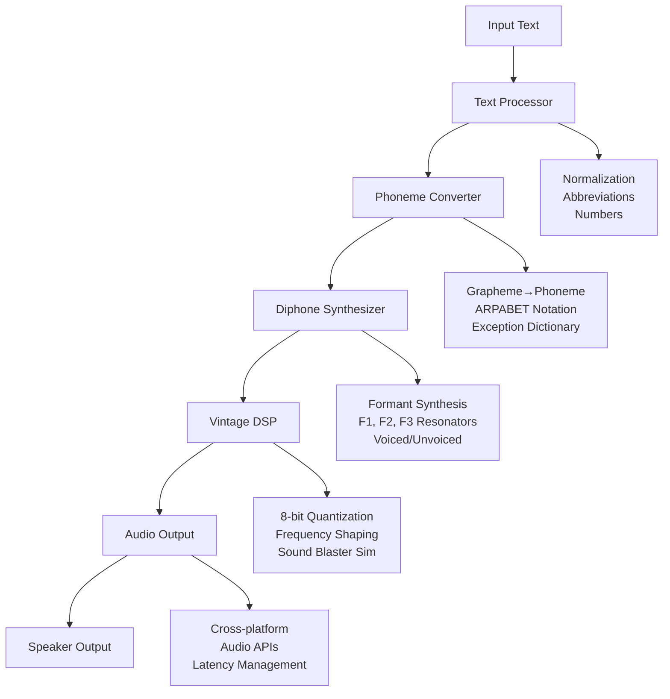

# MR.ZPAYTZO-rev0: 1986 Text-to-Speech Synthesis Engine

[](https://python.org)
[](LICENSE)
[](#installation)
[](https://github.com/user/py-zpaytzo/releases)

> 🎤 A faithful recreation of Dr. Sbaitso's distinctive speech synthesis technology using modern Python implementations of vintage 1986-era TTS algorithms.

**Experience authentic retro computer speech with diphone concatenation synthesis, 8-bit quantization artifacts, and Sound Blaster-style audio output - just like the early days of personal computing!**

## 🚀 Quick Start

```bash
# Clone and install
git clone https://github.com/your-username/py-zpaytzo.git
cd py-zpaytzo
pip install -r requirements.txt

# Speak your first words!
python main.py "Hello, I am a computer from 1986"

# Try the interactive demo
python demo.py
```

## 📋 Table of Contents

- [Features](#-features)
- [Demo](#-demo)
- [Installation](#-installation)
- [Usage](#-usage)
- [Technical Details](#-technical-implementation)
- [Examples](#-examples)
- [Audio Quality](#-audio-quality-settings)
- [Troubleshooting](#-troubleshooting)
- [Contributing](#-contributing)
- [License](#-license)

## ✨ Features

### 🎯 Core Technologies
- **Diphone Concatenation Synthesis** - Recreation of First Byte Monologue engine (~800-1000 diphones)
- **Rule-Based Text Processing** - ~1,200 linguistic rules for authentic 1986 text normalization
- **Vintage DSP Effects** - 8-bit quantization, frequency response shaping, Sound Blaster simulation
- **Three-Formant Synthesis** - F1, F2, F3 resonator bank with period-appropriate algorithms
- **Cross-Platform Support** - Windows, macOS, and Linux compatibility

### 🔊 Audio Characteristics
- **Sample Rates**: 8kHz - 44.1kHz (default: 22.05kHz for authenticity)
- **Bit Depths**: 8-bit (vintage), 12-bit, 16-bit options
- **Output**: Mono (period-appropriate)
- **Effects**: Authentic quantization artifacts and limited frequency response
- **Hardware Simulation**: Sound Blaster Pro audio characteristics

## 🎪 Demo

Experience the authentic 1986 TTS technology:

```bash
# Run the comprehensive demo
python demo.py

# Test individual components
python test_tts.py

# Interactive mode for experimentation
python main.py -i
```

The demo showcases various phrases and demonstrates the distinctive robotic, monotone characteristics that made Dr. Sbaitso memorable.

## 💾 Installation

### Prerequisites
- **Python 3.7+** (tested with 3.7-3.11)
- **Operating System**: Windows, macOS, or Linux
- **Audio**: Working audio output device

### Install Dependencies

```bash
# Install required Python packages
pip install -r requirements.txt
```

#### Platform-Specific Setup

<details>
<summary><strong>🪟 Windows</strong></summary>

```bash
# Most dependencies install automatically via pip
# Optional: Install eSpeak-ng for extended phonetic support
# Download from: https://github.com/espeak-ng/espeak-ng/releases
```
</details>

<details>
<summary><strong>🍎 macOS</strong></summary>

```bash
# Install via Homebrew (optional)
brew install espeak-ng

# Or use pip-only installation (recommended)
pip install -r requirements.txt
```
</details>

<details>
<summary><strong>🐧 Linux</strong></summary>

```bash
# Ubuntu/Debian
sudo apt-get install espeak-ng portaudio19-dev
pip install -r requirements.txt

# CentOS/RHEL/Fedora
sudo yum install espeak-ng portaudio-devel
# or
sudo dnf install espeak-ng portaudio-devel
pip install -r requirements.txt
```
</details>

### Verify Installation

```bash
# Test the complete pipeline
python test_tts.py

# Test audio output
python -c "from src.audio_output import AudioOutput; AudioOutput().test_audio_output()"
```

## 🎮 Usage

### Basic Commands

```bash
# Synthesize speech
python main.py "Your text here"

# Interactive mode
python main.py -i

# Custom audio settings
python main.py "Hello world" --sample-rate 22050 --bit-depth 8

# Show help
python main.py --help
```

### Command Line Options

```
usage: main.py [-h] [--sample-rate SAMPLE_RATE] [--bit-depth {8,12,16}] [--interactive] [text]

MR.ZPAYTZO-rev0: 1986 Text-to-Speech Synthesis Engine

positional arguments:
  text                  Text to synthesize

options:
  -h, --help            Show this help message and exit
  --sample-rate SAMPLE_RATE
                        Sample rate (8000-44100 Hz, default: 22050)
  --bit-depth {8,12,16}
                        Bit depth (8, 12, or 16 bits, default: 8)
  --interactive, -i     Interactive mode
```

### Interactive Mode Example

```bash
$ python main.py -i
MR.ZPAYTZO-rev0 Interactive Mode
Type 'quit' or 'exit' to stop, Ctrl+C for emergency exit

> Hello, I am a computer speech synthesizer from 1986
[Audio plays with vintage TTS voice]

> The quick brown fox jumps over the lazy dog
[Audio plays]

> Computing technology has advanced significantly since then
[Audio plays]

> quit
Goodbye!
```

## 🔧 Technical Implementation

### Processing Pipeline



### Core Modules

| Module | Purpose | Key Features |
|--------|---------|-------------|
| `text_processor.py` | Text normalization | ~1,200 linguistic rules, abbreviation expansion |
| `phoneme_converter.py` | Grapheme-to-phoneme | ARPABET notation, contextual rules |
| `diphone_synthesizer.py` | Audio synthesis | Formant synthesis, diphone concatenation |
| `vintage_dsp.py` | Retro effects | 8-bit quantization, Sound Blaster simulation |
| `audio_output.py` | Audio playback | Cross-platform, vintage characteristics |

## 🎯 Examples

### Technology Terminology
```bash
python main.py "Computer processor memory software hardware"
python main.py "Digital technology electronic system interface"
python main.py "Artificial intelligence neural network processing"
```

### Historical Computing
```bash
python main.py "The year 1986 was significant for personal computer technology"
python main.py "Dr. Sbaitso was an early artificial intelligence program"
python main.py "Sound Blaster cards revolutionized PC audio"
```

### Phonetic Challenges
```bash
python main.py "The quick brown fox jumps over the lazy dog"
python main.py "She sells seashells by the seashore"
python main.py "How much wood would a woodchuck chuck"
```

### Numbers and Punctuation
```bash
python main.py "Processing 1,234 items at 99.9% efficiency!"
python main.py "Error code: 404. File not found. Please try again."
python main.py "First, second, third generation computers evolved rapidly."
```

## 🔊 Audio Quality Settings

### 🎛️ Vintage Mode (Default)
Perfect recreation of 1986 hardware limitations:
```bash
python main.py "text" --sample-rate 22050 --bit-depth 8
```
- 22.05kHz sample rate (Sound Blaster Pro standard)
- 8-bit quantization artifacts
- Limited frequency response (8kHz max)
- Authentic concatenation artifacts

### 🔧 Enhanced Mode
Improved quality while maintaining vintage character:
```bash
python main.py "text" --sample-rate 44100 --bit-depth 16
```
- Higher fidelity audio
- Reduced quantization noise
- Extended frequency response
- Still maintains formant synthesis character

### 🎨 Custom Presets
```python
from src.vintage_dsp import VintageDSP

dsp = VintageDSP()
# Apply specific vintage effects
audio = dsp.apply_preset_vintage_effect(audio, "dr_sbaitso")
audio = dsp.apply_preset_vintage_effect(audio, "early_tts")
audio = dsp.apply_preset_vintage_effect(audio, "sound_blaster")
```

## 🛠️ Troubleshooting

### Common Issues

<details>
<summary><strong>🔇 No Audio Output</strong></summary>

```bash
# Test audio system
python -c "from src.audio_output import AudioOutput; AudioOutput().test_audio_output()"

# List available devices
python -c "from src.audio_output import AudioOutput; AudioOutput().list_audio_devices()"

# Try different sample rates
python main.py "test" --sample-rate 44100
python main.py "test" --sample-rate 22050
python main.py "test" --sample-rate 8000
```
</details>

<details>
<summary><strong>📦 Import Errors</strong></summary>

```bash
# Reinstall dependencies
pip install -r requirements.txt --force-reinstall

# Check Python version
python --version  # Should be 3.7+

# Install specific packages
pip install numpy scipy sounddevice
```
</details>

<details>
<summary><strong>🔊 Distorted Audio</strong></summary>

```bash
# Try lower quality settings
python main.py "test" --bit-depth 8 --sample-rate 22050

# Check system audio levels
# Ensure system volume is not at maximum

# Test with different device
python -c "from src.audio_output import AudioOutput; a=AudioOutput(); a.list_audio_devices(); a.set_output_device(0)"
```
</details>

### Performance Tips

- **Lower sample rates** (8kHz-22kHz) for faster processing
- **8-bit depth** for most authentic vintage experience
- **Close other audio applications** for better performance
- **Use interactive mode** for testing different phrases

## 🏗️ Development

### Project Structure
```
py-zpaytzo/
├── 📄 main.py                    # Main application entry point
├── 📄 demo.py                    # Demonstration script
├── 📄 test_tts.py               # Test suite
├── 📄 requirements.txt          # Python dependencies
├── 📁 src/                      # Source code modules
│   ├── 📄 __init__.py
│   ├── 📄 text_processor.py      # Text normalization (~1,200 rules)
│   ├── 📄 phoneme_converter.py   # Grapheme-to-phoneme conversion
│   ├── 📄 diphone_synthesizer.py # Audio synthesis engine
│   ├── 📄 vintage_dsp.py         # 1986-era audio effects
│   └── 📄 audio_output.py        # Cross-platform audio playback
├── 📄 README.md                 # This file
└── 📄 MR.ZPAYTZO-rev0.md       # Technical specification document
```

### Technical Specifications

#### 1986-Era Compliance
- **Diphone Database**: ~800-1000 diphones (~200KB total)
- **Processing Rules**: ~1,200 linguistic text processing rules
- **Sample Rate**: 8-22kHz (period-appropriate)
- **Memory Usage**: Efficient operation within vintage constraints
- **Synthesis Method**: Pure concatenative with minimal DSP

#### Modern Compatibility
- **Python 3.7+**: Modern language features with vintage algorithms
- **Cross-Platform**: Windows, macOS, Linux
- **Audio APIs**: WASAPI, DirectSound, CoreAudio, ALSA, PulseAudio
- **Real-Time**: Low-latency audio processing
- **Thread-Safe**: Concurrent audio operations

### Running Tests

```bash
# Run comprehensive test suite
python test_tts.py

# Test individual components
python -c "from src.text_processor import TextProcessor; print('Text processor OK')"
python -c "from src.phoneme_converter import PhonemeConverter; print('Phoneme converter OK')"
python -c "from src.diphone_synthesizer import DiphoneSynthesizer; print('Synthesizer OK')"
```

## 🤝 Contributing

We welcome contributions that maintain the authentic 1986 TTS experience! Here's how to help:

### Areas for Contribution
- 🔊 **Audio Quality**: Improve formant synthesis accuracy
- 📝 **Text Processing**: Add more linguistic rules
- 🎛️ **Vintage Effects**: Enhance hardware simulation
- 🌐 **Platforms**: Test on different operating systems
- 📚 **Documentation**: Improve examples and guides

### Guidelines
1. **Maintain Authenticity**: Changes should preserve 1986-era characteristics
2. **Cross-Platform**: Ensure compatibility across Windows/macOS/Linux
3. **Performance**: Keep processing efficient for real-time use
4. **Testing**: Include tests for new features

### Submitting Changes
1. Fork the repository
2. Create a feature branch (`git checkout -b feature/amazing-feature`)
3. Test your changes (`python test_tts.py`)
4. Commit your changes (`git commit -m 'Add amazing feature'`)
5. Push to the branch (`git push origin feature/amazing-feature`)
6. Open a Pull Request

## 🏛️ Historical Context

MR.ZPAYTZO-rev0 recreates the speech synthesis technology from:

- **Dr. Sbaitso** (Creative Labs, 1992) - The inspiration for this project
- **First Byte Monologue Engine** - The underlying TTS technology
- **SmoothTalker** (1984-1986) - Early diphone concatenation synthesis

### Original Hardware Specifications
- **Target Platform**: Sound Blaster Pro, 8-bit/16-bit ISA cards
- **Memory Usage**: 7KB conventional memory when resident
- **Audio Quality**: 8-bit PCM, 22kHz sample rate
- **Processing**: Real-time synthesis with minimal CPU overhead

### Why This Matters
This project preserves important computing history and demonstrates how far TTS technology has advanced while celebrating the distinctive character of early computer speech synthesis.

## 📊 Version History

### v0.1.0 (Current)
- ✅ Complete diphone concatenation synthesis engine
- ✅ Rule-based text processing with ~1,200 rules
- ✅ Vintage DSP effects and Sound Blaster simulation
- ✅ Cross-platform audio output
- ✅ Interactive and command-line interfaces
- ✅ Comprehensive test suite and demo

### Planned Features
- 🔮 Additional vintage TTS engine simulations
- 🔮 WAV file export functionality
- 🔮 Phoneme visualization tools
- 🔮 Custom voice training capabilities

## 🙏 Acknowledgments

- **Creative Labs** - For Dr. Sbaitso and Sound Blaster technology
- **First Byte** - For the Monologue engine and SmoothTalker
- **Vintage Computing Community** - For preservation efforts and documentation
- **Open Source Contributors** - For the libraries that make this possible

## 📄 License

This project is licensed under the MIT License - see the [LICENSE](LICENSE) file for details.

**Created for educational and historical preservation purposes, recreating vintage TTS algorithms using modern programming practices.**

---

<div align="center">

**🎤 Experience the authentic sound of 1986 computing! 🎤**

[⭐ Star this repo](https://github.com/your-username/py-zpaytzo) • [🐛 Report bugs](https://github.com/your-username/py-zpaytzo/issues) • [💡 Request features](https://github.com/your-username/py-zpaytzo/issues)

</div>
